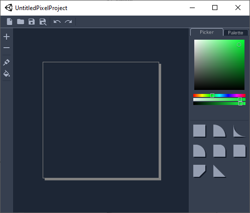
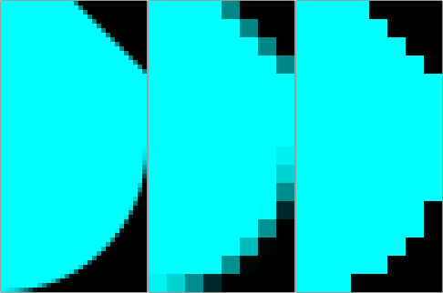

# Untitled Pixel Project Docs
This currently-untitled project is a new program designed to help everyone create 2D art assets, in both pixel art or HD vectors.
With a simple set of tools, the program allows users to place down specific pre-made vector shapes, and export them as vector or image files.

## Image Creation
With a simple set of tools, creating images is extremely simple.

### Tools
- Add Tool - Add the currently selected shape & color by drawing on the grid
- Remove Tool - Remove shapes by drawing on the grid
- Paint Tool - Paint shapes with the currently selected color
- Fill Area Tool - Paint a contiguous area with the currently selected color
- Fill Layer Tool* - Paint an entire layer with the currently selected color
- Pipette Tool* - Replace the currently selected shape & color with that of a tile
- Shape Pipette* - Replace the currently selected shape with that of a tile
- Color Pipette* - Replace the currently selected color with that of a tile

_*Will be added before first release._

### Shape
The current shape can be selected by clicking the wanted shape in the shapes panel. It can also be selected by using the _Shape Pipette_ tool.

### Color
The current color can be decided from a few different methods.
- Color wheel
- HSV + RGB Sliders
- Palette + Recently Used Colors
- Using the _Color Pipette_ tool

## Exporting
Created images can be exported at nearly any resolution. Simply input how many pixels each grid tile is worth, and the program will export an image file at that resolution. Edge smoothing can be enabled or disabled.

 

_A showcase of 3 types of export on an extremely simple image. Left - Tile size: 32, AA: Enabled. Middle - Tile size: 8, AA: Enabled. Right - Tile size: 8, AA: Disabled._

## Shapes
The program comes with some useful pre-existing shapes. These are defined in SVG files that are included within the program. 

### Creating new shapes
To create a new shape, firstly use one of the existing shape files as a template. These can be found at: (ProjectPath)/Project_Data/StreamingAssets/Vector Shapes. Copy and paste one of the existing files, and give it a unique name.

To edit SVG files, I recommend the use of Inkscape, a free vector editor. 

On loading your new file, you should see the object that you copied, as well as the Inkscape canvas. Select the object and delete it. This leaves you with an empty canvas that is 1 square inch, the required measurement for the program.

Now you can design your own shape. The following rules apply for designing shapes:
- Keep your image inside the canvas
- Ensure shapes do not have stroke data
- Any color data will not show in the program
- Only use one layer
- Keep it simple - Filters, extensions, and fancy stuff like that may not work as expected

Save your new shape, and load the program. Your shape should appear in the shape selection panel.

If your shape does not appear, then ensure your layer has an ID of "layer1" (no caps). This can be done by opening the SVG file in a text editor, and checking usually around line 40 if using inkscape. 
